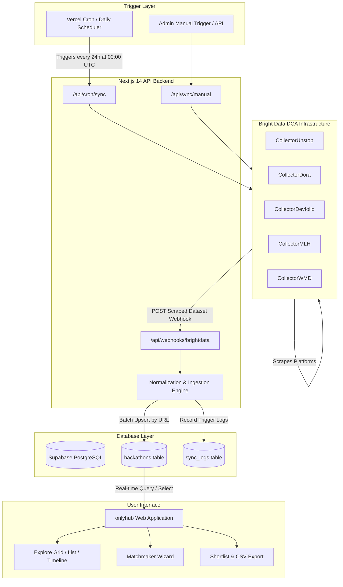

# onlyhub • Hackathon Radar 🌐🚀

> **The global terminal for builders, engineers, and creators.**  
> An automated, high-performance hackathon discovery and intelligence platform aggregating live developer competitions, Web3 buildathons, and collegiate hackathons across 5 major ecosystems.

Built with ❤️ for the **[Into the Scrape-Verse Hackathon](https://www.wemakedevs.org/hackathons/scrape-verse)** by **WeMakeDevs**.

---

## 📌 Table of Contents
- [🌟 Project Overview](#-project-overview)
- [✨ Core Features](#-core-features)
- [🏗️ Architecture & Flow Diagram](#️-architecture--flow-diagram)
- [🛠️ Tech Stack & Service Utilization](#️-tech-stack--service-utilization)
- [⚡ Bright Data Scraping Pipeline](#-bright-data-scraping-pipeline)
- [🗄️ Database Architecture (Supabase)](#️-database-architecture-supabase)
- [💻 Local Setup & Installation](#-local-setup--installation)
- [⏰ Automated Daily Ingestion (Vercel Cron & Webhooks)](#-automated-daily-ingestion-vercel-cron--webhooks)
- [🏆 Hackathon Submission Details](#-hackathon-submission-details)
- [📄 License](#-license)

---

## 🌟 Project Overview

Developers and students miss out on career-defining hackathons, bounties, and grants because information is fragmented across dozens of disparate websites—Devfolio, DoraHacks, MLH, Unstop, and WeMakeDevs—each with different date formats, obscure registration rules, and lack of central calendar tracking.

**onlyhub** solves this by:
1. **Automated Scraping via Bright Data DCA**: Continuously extracting structured event listings from major platforms without getting blocked or throttled.
2. **Unified Data Normalization**: Cleaning complex dates, format modes (Online, In-Person, Hybrid), prize pools, locations, and domain tracks (AI & ML, Web3, Fintech, Hardware, Open Source).
3. **Real-time Supabase Persistence**: Storing records in a PostgreSQL database with unique URL upsert deduplication and high-performance GIN indexing.
4. **Uber-Inspired Minimalist Web Interface**: Delivering a fast, black-and-white, pill-geometry design language with instant search (`⌘K`), multiple viewing perspectives, an AI Matchmaker wizard, and an application Kanban shortlist tracker.

---

## ✨ Core Features

### 1. 🔍 Multi-Platform Aggregated Exploration (160+ Events)
- Single pane of glass for **Devfolio**, **DoraHacks**, **MLH**, **Unstop**, and **WeMakeDevs**.
- Instant full-text search with `⌘K` shortcut across titles, universities, stacks, and tags.
- Filter by category tracks (*AI & ML*, *Web3 & Crypto*, *Open Source*, *Fintech*, *IoT*, *Cybersecurity*).

### 2. 🟢 Dynamic Real-Time Status Classification
- **🟢 Ongoing**: Actively live hackathons (`now >= startDate && now <= endDate`) with pulsing live indicator and days-remaining countdowns.
- **🗓️ Upcoming**: Future events with start proximity calculation (`In 3d`, `Starts Tomorrow`, `Starts in ~2mo`).
- **🏁 Completed**: Past events automatically archived with direct access to official portfolios and winning projects.

### 3. 🪄 3-Step Matchmaker AI Wizard
- Interactive onboarding quiz tailored to experience level (*Student/Beginner*, *Experienced Builder*, *Specialist Hacker*), format preferences, and domain focus.
- Automatically calculates compatibility scores and surfaces the top 4 matched hackathons.

### 4. 🗂️ Application Shortlist & Kanban Stage Tracker
- Save target hackathons with one click.
- Track application stages: `Bookmarked` ➔ `Applying` ➔ `Applied` ➔ `Shortlisted` ➔ `Attending` ➔ `Completed`.
- Add private notes (team ideas, project pitches, deadlines).
- **One-Click CSV Export** for team collaboration and spreadsheet tracking.

### 5. 📅 Calendar Integration & One-Click Sync
- Direct **Google Calendar** event generation with auto-filled venue/mode, short description, and links.
- Instant **Apple iCal / `.ics`** calendar file download.

### 6. 📊 Radar Insights Landscape Analytics
- Platform share distribution progress bars.
- Live technology rankings and category volume breakdown.
- Online vs. In-Person campus ratio metrics.

### 7. 🔲 Multi-Perspective Layout Views
- **Grid View**: Clean 16px radius cards with 16:9 photography frames and floating badges.
- **List View**: High-density data table for power users.
- **Timeline View**: Month-by-month chronological roadmap with timeline node markers.

---

## 🏗️ Architecture & Flow Diagram



---

## 🛠️ Tech Stack & Service Utilization

| Layer | Technology | Purpose |
| :--- | :--- | :--- |
| **Framework** | **Next.js 14 (App Router)** | Full-stack React framework with SSR and API routes |
| **Language** | **TypeScript** | Strict typing across normalization pipelines and schemas |
| **Styling** | **Tailwind CSS + PostCSS** | Minimalist Uber-grade black & white design system |
| **Web Scraping** | **Bright Data DCA (Data Collector API)** | Automated, enterprise-grade cloud scraping across 5 sources |
| **Database** | **Supabase (PostgreSQL)** | Persistent storage with RLS, unique constraints, and GIN indexes |
| **Icons & UI** | **Lucide React** | Feather-light SVG iconography |
| **Date Engine** | **date-fns** & Custom Parser | Complex multi-format date extraction and status classification |
| **Animations** | **canvas-confetti** | Interactive celebration triggers |
| **Cron Scheduling** | **Vercel Cron** | Zero-maintenance 24-hour recurring scraping job |

---

## ⚡ Bright Data Scraping Pipeline

**onlyhub** leverages Bright Data's **Data Collector API (DCA)** to bypass CAPTCHAs, bot protections, and geographic restrictions:

| Platform | Target Endpoint |
| :--- | :--- |
| **Unstop** | `https://unstop.com/hackathons?oppstatus=open&usertype=fresher&fresherPassingOutYear=2025` |
| **DoraHacks** | `https://dorahacks.io/hackathon` |
| **Devfolio** | `https://devfolio.co/hackathons` |
| **MLH** | `https://www.mlh.com/seasons/2027/events` |
| **WeMakeDevs** | `https://www.wemakedevs.org/hackathons` |

---

## 🗄️ Database Architecture (Supabase)

### `public.hackathons` Table
```sql
CREATE TABLE public.hackathons (
    id TEXT PRIMARY KEY,
    title TEXT NOT NULL,
    platform TEXT NOT NULL, -- 'devfolio', 'dorahacks', 'mlh', 'unstop', 'wemakedevs'
    mode TEXT NOT NULL,     -- 'Online', 'In-Person', 'Hybrid'
    start_date TEXT,
    end_date TEXT,
    display_dates TEXT NOT NULL,
    image_url TEXT NOT NULL,
    url TEXT UNIQUE NOT NULL,
    description TEXT,
    short_description TEXT,
    tags TEXT[] DEFAULT '{}',
    prize_pool TEXT,
    location TEXT,
    organizer TEXT,
    status TEXT DEFAULT 'upcoming', -- 'ongoing', 'upcoming', 'completed'
    featured BOOLEAN DEFAULT FALSE,
    raw_data JSONB,
    created_at TIMESTAMP WITH TIME ZONE DEFAULT timezone('utc'::text, now()) NOT NULL,
    updated_at TIMESTAMP WITH TIME ZONE DEFAULT timezone('utc'::text, now()) NOT NULL
);
```

### `public.sync_logs` Table
Tracks every execution of the Bright Data collector jobs, recording response IDs, item counts, and status (`triggered`, `completed`, `failed`).

---

## 💻 Local Setup & Installation

### Prerequisites
- [Node.js](https://nodejs.org/) (v18 or newer)
- A [Supabase](https://supabase.com/) project
- A [Bright Data](https://brightdata.com/) account with an API token

### 1. Clone the Repository
```bash
git clone https://github.com/your-username/onlyhub.git
cd onlyhub
```

### 2. Install Dependencies
```bash
npm install
```

### 3. Setup Environment Variables
Create a `.env.local` file in the root directory:
```env
# Supabase Configuration
NEXT_PUBLIC_SUPABASE_URL=https://your-project.supabase.co
NEXT_PUBLIC_SUPABASE_ANON_KEY=your-anon-public-key
SUPABASE_SERVICE_ROLE_KEY=your-service-role-secret-key

# Bright Data API Token
BRIGHT_DATA_API_TOKEN=your_bright_data_api_token

# Cron Security Key (Generate with: node -e "console.log(require('crypto').randomBytes(32).toString('hex'))")
CRON_SECRET=your_custom_secure_cron_secret

# App URL
NEXT_PUBLIC_APP_URL=http://localhost:3000
```

### 4. Create Database Tables
1. Open the **SQL Editor** in your [Supabase Dashboard](https://supabase.com/dashboard).
2. Paste the contents of [`supabase/schema.sql`](supabase/schema.sql) and click **Run**.

### 5. Seed Initial Data
Seed the 160+ pre-extracted hackathon records into Supabase:
```bash
npm run seed
```

### 6. Start the Development Server
```bash
npm run dev
```
Open **[http://localhost:3000](http://localhost:3000)** in your browser!

---

## ⏰ Automated Daily Ingestion (Vercel Cron & Webhooks)

### 1. Automatic Vercel Cron (`vercel.json`)
The included `vercel.json` automatically triggers `/api/cron/sync` every day at midnight UTC:
```json
{
  "crons": [
    {
      "path": "/api/cron/sync",
      "schedule": "0 0 * * *"
    }
  ]
}
```

### 2. Manual Trigger via cURL
To trigger a manual scraping job across all collectors:
```bash
curl -X GET http://localhost:3000/api/cron/sync \
  -H "Authorization: Bearer YOUR_CRON_SECRET"
```

To trigger a single platform:
```bash
curl -X POST http://localhost:3000/api/sync/manual \
  -H "Content-Type: application/json" \
  -d '{"platform":"wemakedevs"}'
```

---

## 🏆 Hackathon Submission Details

- **Hackathon**: [Into the Scrape-Verse Hackathon](https://www.wemakedevs.org/hackathons/scrape-verse)
- **Organized By**: [WeMakeDevs](https://www.wemakedevs.org) & [Bright Data](https://brightdata.com)
- **Project Name**: **onlyhub**
- **Theme**: Automated Web Scraping & Developer Tooling

---

## 📄 License

This project is licensed under the **MIT License** — see the [LICENSE](LICENSE) file for details.
